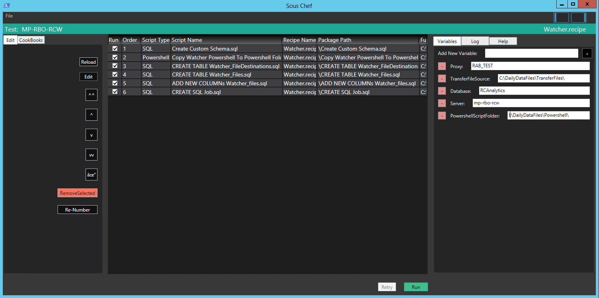

# Sous Chef
## The flexible framework for Implementation

## Sous Chef in action!

Sous chef is a framework to help run SQL and Powershell scripts. The main features are:
- preserve order of scripts to run
- add variables to scripts in a flexible way
- transport code between projects
- reuse code by referencing them in recipes

